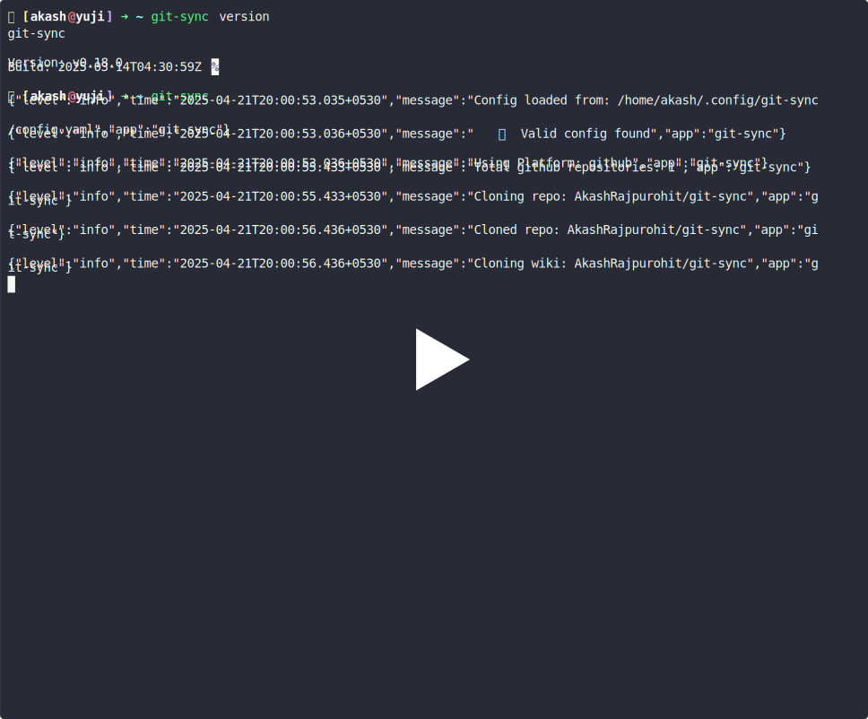

  

    <h2>🔄 git-sync</h2>
    
A simple tool to backup and sync your git repositories

    
    <a href="https://goreportcard.com/report/github.com/AkashRajpurohit/git-sync">
    
    
    
    
    
    
    
    
     
     
    

      <a href="https://github.com/AkashRajpurohit/git-sync/issues/new?template=bug_report.yml">Bug report</a>
      ·
      <a href="https://github.com/AkashRajpurohit/git-sync/issues/new?template=feature_request.yml">Feature request</a>
      ·
      <a href="https://github.com/AkashRajpurohit/git-sync/wiki">Read Docs</a>
    

`git-sync` is a CLI tool designed to help you back up your Git repositories. This tool ensures you have a local copy of your repositories, safeguarding against potential issues such as account bans or data loss.

## 📺 Demo

## 🤔 Why `git-sync`?

Remember when `@defunkt` [GitHub account got banned?](https://twitter.com/defunkt/status/1754610843361362360) Well, he is the co-founder of GitHub so he did get his account un-banned pretty quickly but what if you are not that lucky?

Recently I have seen many developers [getting their GitHub account banned](https://www.reddit.com/r/github/search/?q=account+got+banned&sort=new) and losing access to their repositories. Some may be able to recover their account (but there is delay in that) and some may not be able to recover their account at all. What would you do if you lose access to your repositories? What if GitHub goes down? What if you accidentally delete your repositories? The answer is simple, you should have a backup of your repositories.

`git-sync` provides a straightforward way to back up all your repositories locally, ensuring you have access to your code whenever you need it. It does this by doing a bare clone of all your repositories in a specified directory so that you can recover your code in case of any unforeseen circumstances as well as the file size of your backups is minimal.

## ✨ Features

- **Backup All Repositories:** Automatically clone or update all your GitHub repositories to a local directory.
- **Periodic Sync:** Keep your backups in sync with your remote repositories by running `git-sync` [periodically](https://github.com/AkashRajpurohit/git-sync/wiki/Setup-Periodic-Backups).
- **Multi Clone:** While git-sync was designed to work with bare clones to save space and speed up the syncing process, it also supports shallow, mirror and full clones too.
- **Concurrency:** Sync multiple repositories concurrently to reduce the time required for backup.
- **Configuration File:** Easily manage your settings through a YAML configuration file.
- **Custom Backup Directory:** Specify the directory where you want to store your repositories.
- **Multi Platform:** Currently this project supports backing up repositories from all major Git hosting services like GitHub, GitLab, Bitbucket, Gitea and Forgejo.
- **Notifications:** Get notified when your sync is complete, or if there are any errors.

## 🚀 Getting Started

We have a thorough guide on how to set up and get started with `git-sync` in our [documentation](https://github.com/AkashRajpurohit/git-sync/wiki).

## 🙏🏻 Support

If you found the project helpful, consider giving it a star ⭐️. If you would like to support the project in other ways, you can [buy me a coffee](https://ko-fi.com/akashrajpurohit) or [sponsor me on GitHub](https://github.com/sponsors/AkashRajpurohit).

## 🐛 Bugs or Requests

If you encounter any problems feel free to open an [issue](https://github.com/AkashRajpurohit/git-sync/issues/new?template=bug_report.yml). If you feel the project is missing a feature, please raise a [ticket](https://github.com/AkashRajpurohit/git-sync/issues/new?template=feature_request.yml) on GitHub and I'll look into it. Pull requests are also welcome.

## 🫱🏻‍🫲🏼 Contributors

<!-- ALL-CONTRIBUTORS-LIST:START - Do not remove or modify this section -->
<!-- prettier-ignore-start -->
<!-- markdownlint-disable -->
<table>
  <tbody>
    <tr>
      <td align="center" valign="top" width="14.28%"><a href="https://akashrajpurohit.com/?ref=git-sync"> <b>Akash Rajpurohit</b></a> <a href="#code-AkashRajpurohit" title="Code">💻</a> <a href="#ideas-AkashRajpurohit" title="Ideas, Planning, & Feedback">🤔</a> <a href="#review-AkashRajpurohit" title="Reviewed Pull Requests">👀</a> <a href="#doc-AkashRajpurohit" title="Documentation">📖</a> <a href="#question-AkashRajpurohit" title="Answering Questions">💬</a> <a href="#platform-AkashRajpurohit" title="Packaging/porting to new platform">📦</a></td>
      <td align="center" valign="top" width="14.28%"><a href="https://joao.bonadiman.dev"> <b>João Vitor Bonadiman</b></a> <a href="#code-jbonadiman" title="Code">💻</a> <a href="#ideas-jbonadiman" title="Ideas, Planning, & Feedback">🤔</a> <a href="#question-jbonadiman" title="Answering Questions">💬</a></td>
      <td align="center" valign="top" width="14.28%"><a href="https://qlaffont.com"> <b>Quentin Laffont</b></a> <a href="#code-qlaffont" title="Code">💻</a></td>
      <td align="center" valign="top" width="14.28%"><a href="https://github.com/acompagno"> <b>Andre Compagno</b></a> <a href="#code-acompagno" title="Code">💻</a></td>
      <td align="center" valign="top" width="14.28%"><a href="https://janusworx.com"> <b>Mario Jason Braganza</b></a> <a href="#bug-jasonbraganza" title="Bug reports">🐛</a></td>
      <td align="center" valign="top" width="14.28%"><a href="https://blog.singee.me"> <b>Bryan</b></a> <a href="#ideas-ImSingee" title="Ideas, Planning, & Feedback">🤔</a></td>
      <td align="center" valign="top" width="14.28%"><a href="https://github.com/3timeslazy"> <b>Vladimir Fetisov</b></a> <a href="#ideas-3timeslazy" title="Ideas, Planning, & Feedback">🤔</a> <a href="#bug-3timeslazy" title="Bug reports">🐛</a></td>
    </tr>
    <tr>
      <td align="center" valign="top" width="14.28%"><a href="https://www.peterdavehello.org/"> <b>Peter Dave Hello</b></a> <a href="#platform-PeterDaveHello" title="Packaging/porting to new platform">📦</a></td>
    </tr>
  </tbody>
</table>

<!-- markdownlint-restore -->
<!-- prettier-ignore-end -->

<!-- ALL-CONTRIBUTORS-LIST:END -->

## 👀 Who am I?

